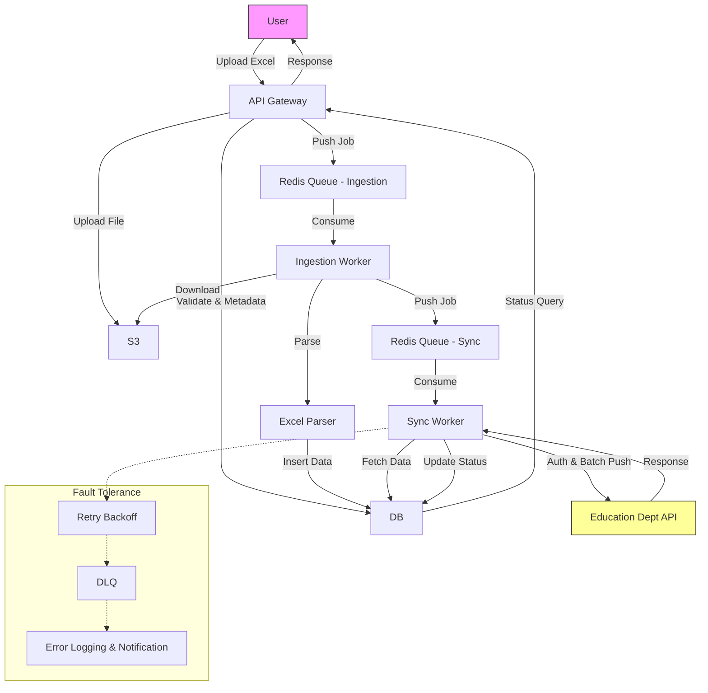

```mermaid
flowchart TD
    A[User] -->|Upload Excel| B[API Gateway]
    B -->|Validate & Metadata| C[DB]
    B -->|Upload File| D[S3]
    B -->|Push Job| E[Redis Queue - Ingestion]
    E -->|Consume| F[Ingestion Worker]
    F -->|Download| D
    F -->|Parse| G[Excel Parser]
    G -->|Insert Data| C
    F -->|Push Job| H[Redis Queue - Sync]
    H -->|Consume| I[Sync Worker]
    I -->|Fetch Data| C
    I -->|Auth & Batch Push| J[Education Dept API]
    J -->|Response| I
    I -->|Update Status| C
    C -->|Status Query| B
    B -->|Response| A
    subgraph "Fault Tolerance"
        K[Retry Backoff]
        L[DLQ]
        M[Error Logging & Notification]
    end
    %% F -.-> K
    I -.-> K
    K -.-> L
    L -.-> M
    style A fill:#f9f,stroke:#333
    style J fill:#ff9,stroke:#333
```